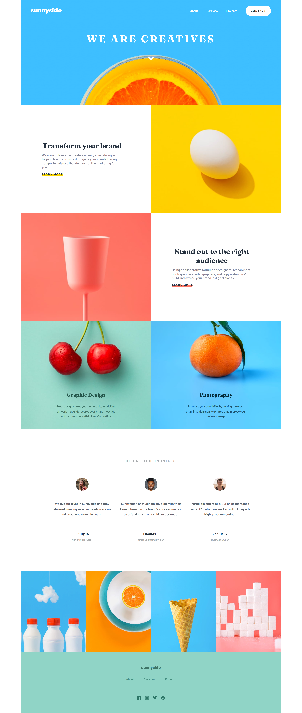

# Frontend Mentor - Sunnyside agency landing page solution

This is a solution to the Sunnyside agency landing page challenge on Frontend Mentor.

## Overview

### The challenge

Users should be able to:

- View the optimal layout depending on their device's screen size
- See hover states for interactive elements
- Open and close the mobile navigation menu
- Navigate the page using a keyboard

### Screenshot

### Links

- Solution URL: [Frontend Mentor solution](https://www.frontendmentor.io/challenges/agency-landing-page-7yVs3B6ef)
- Live Site URL: [https://visockijanatolij1-sys.github.io/sunnyside-agency-landing-page/]

## My process

### Built with

- Semantic HTML5 markup
- SCSS
- Flexbox
- Responsive design
- JavaScript
- Accessible mobile navigation

### What I learned

This project helped me practice building layouts where images can either be
content or part of the background.

I also improved my understanding of responsive navigation. The same navigation
is used on desktop and mobile, while CSS controls its visual state and
JavaScript only controls whether the menu is open or closed.

I also practiced making an off-screen/hidden navigation accessible using
`aria-expanded`, `aria-controls`, `inert`, and visible keyboard focus states.

One challenge I faced was implementing the mobile navigation menu. At first,
I struggled to keep the layout, visual state, and JavaScript behavior separate.
I solved this by letting CSS handle how the menu is displayed and using
JavaScript only to toggle its open state. This made the component simpler and
easier to reason about.

### Continued development

I want to continue improving responsive layouts, accessibility, and reusable
JavaScript patterns for interactive components.

## Author

- Frontend Mentor - [@visockijanatolij1-sys]